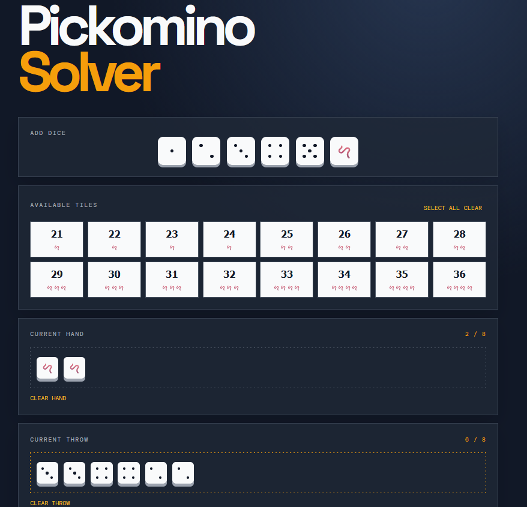

# Regenwormen solver

[](https://github.com/LarsPAJanssen/pickomino_solve/actions/workflows/pre-commit.yml)

A web-based implementation of the Regenwormen / Pickomino dice game with an AI solver. The browser UI is served by the frontend container, the API is exposed through FastAPI, and the solver lives in a Rust extension compiled via PyO3.



## Features

- Interactive browser UI with dice editing and live solver results.
- Rust-backed solver logic for faster action evaluation and search.
- Docker Compose setup for running the full app locally or on a server.

## Getting Started

### Prerequisites

- Docker and Docker Compose
- For local API development: Python 3.12+, `uv`, and a Rust toolchain

### Quick Start

Start the full application with Docker Compose:

```bash
docker-compose up -d --build
```

The compose file is wired for an external reverse proxy on `proxy_net`, so the frontend is not published on `localhost` by default.

If you want to reach it directly from your machine, uncomment the `80:80` port mapping in [`docker-compose.yml`](docker-compose.yml) and open:

- Frontend: `http://127.0.0.1`

The frontend proxies API requests to the API container automatically, so you do not need to expose the API port publicly for normal use.

## Development

The project is split into three parts:

- `frontend/`: Static UI served by nginx, including the `/api/` proxy configuration. In all transparency, the frontend is written by an LLM.
- `api/`: FastAPI application that wraps and exposes the solver.
- `solver/`: Rust/PyO3 solver crate used by the API package.

### Backend Setup

```bash
cd api
uv sync
uv run uvicorn pickomino_solver.main:app --reload --host 0.0.0.0 --port 6000
```

### Rust Solver Development

The performance-critical game logic is implemented in `solver/src/`.

```bash
cd solver
cargo test
```

## API

The API exposes a single solver endpoint:

- `POST /api/run`

Request payload:

- `hand`: frequency vector of length 6 for saved dice
- `dice_throw`: optional frequency vector of length 6 for the current throw
- `tiles`: list of tiles that are available to choose from

## License

[MIT](LICENSE)
